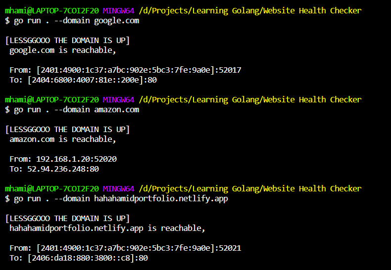
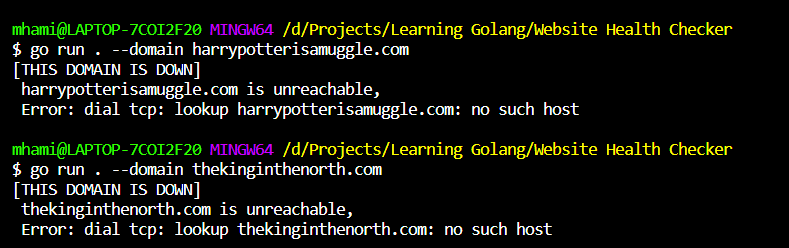

## Website Health Checker.

A tiny tool that checks the given domain is up or not.

**Get the repo.**

```bash
go get github.com/hahahamid/go-health-checker
```
OR

```bash
git clone https://github.com/hahahamid/GO-Website-Health-Checker.git
```
and then CD into the project and run

```bash
go run . --domain pexels.com
```

## Screenshots 



